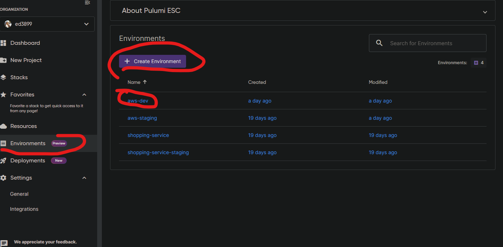
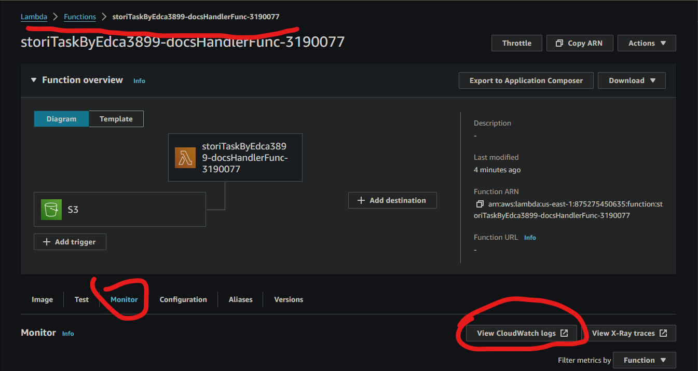
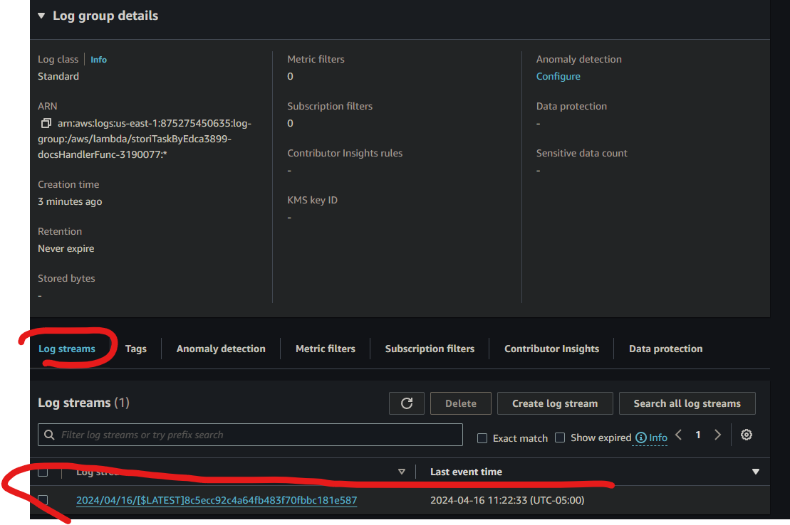
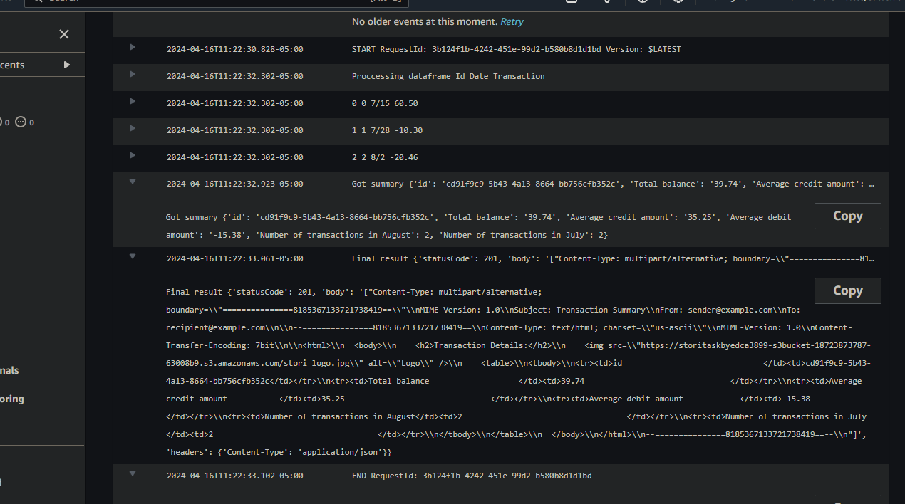

# Stori Task

This is task designed to test Eduardo Alfredo Casanova Lope skills while applying for a Sr. Engineer position at Stori

## Requirements

- Node >= 20.12.1
- Pulumi >= 3.112.0
- Docker >= 24.0.9-1 ~> May be needed for building up the lambda image, however it may be that the process is already taken care at AWS servers.
- AWS

## Setup

1. Create an account at [pulumi](https://www.pulumi.com/docs/get-started/) and get a [token](https://www.pulumi.com/docs/pulumi-cloud/access-management/access-tokens/#personal-access-tokens).
2. Create an [environment](https://www.pulumi.com/docs/esc/) named `aws-dev`. This is the environment where AWS credentials are stored instead of locally.

3. Connect your environment with [aws](https://www.pulumi.com/docs/esc/environments/#using-secrets-providers-and-oidc)
4. Change directory to `pulumi/` and run `npm i`
5. Run `pulumi up -y`

## Try

1. Upload the `transactions.csv` to the created S3 bucket
2. Go to your lambdas at the aws console and then look for the cloudwatch group of that lambda

3. Look for the latest log stream

4. You should see the result output (an example is shown below)

## System Design

### Picking the right tooling

The first step consisted on picking the right language, either Python or Go.

Python was picked because the problem at hand seemed to be more on the data processing end of things. The problem's patterns seemed to be more high level.

Pandas was picked as the core library for taking on the task. It is a library with a mature ecosystem, production ready features and C bindings that may help us with performance.

Although high performance may be an issue later down the road, assuming all things have been tried already (i.e worker pools, etc), the root of all evil is pre-optimization. We should focus first on getting it right, rather than getting it fast.

Go may be an amazing language with easy to understand and to use concurrency patterns (i.e fan-it, fan-out, pipelines, channels, routines), but it was not initially designed with data processing in mind. It's zen consist on simple control over low-level features. Nonetheless, it has its place once you start needing a bulldozer for heavy data processing where the patterns may already be clear enough.

Conda was used as the environment manager for Python just because it was the already installed choice at hand and the developer shall pick the tools she considers the most productive ones, unless other tool had been chosen by someone else with higher status on the team. However it was only used for local development to aid with intellisense, when a lambda container image is uploaded a `requirements.txt` is used instead of a `environment.yml`.

### IaC

A serverless architecture was a clear requirement.

A couple of choices were in mind to handle that.

These were the requirements for a serverless framework:

- Easy to use
- Lambdas shall be easy to package and manage
- Familiarity of dsl
- Local testing if possible

Here is a list of all of them. The last one being the one picked and all with some description of the thought process around them.

1. [SAM](https://aws.amazon.com/serverless/sam/) - Mature, hard to use (packaging the lambdas was a pain), own dsl, local testing available, free.
2. [AWS CDK](https://aws.amazon.com/cdk/) - Inmature (python's module), medium to use (packaging the lambdas was a pain), in python, local testing not available, free
3. [Serverless framework](https://www.serverless.com/framework) - Mature, ???, own dsl, local testing available, partially free
4. [Pulumi](https://www.pulumi.com/docs/) - Mature (Typescript), easy to use, typescript, local testing not available, partially free <- CHOICE

The conclusion was that handling IaC was going to be easier with Typescript, a mature ecosystem and a streamlined processing for deploying the lambdas.

It is also worth nothing that pulumi has a Python module, but because it was developed Typescript first, some of the features required for this task were not yet available for Python.

Nonetheless, if language monopolization had been a requirement for the task. The choice would have been between AWS CDK or Serverless framework.

### Why typings in python?

Typing hints help a lot with intellisense improving DX. However, use them with caution

### Why not docker compose to run locally?

One of the bonus points in the task clearly expressed the option of using AWS Lambda and S3 in lieu of Docker.

Running a docker compose file would have been counterproductive by affecting the speed of development.

If local testing had been a requirement, then SAM would have been chosen.
